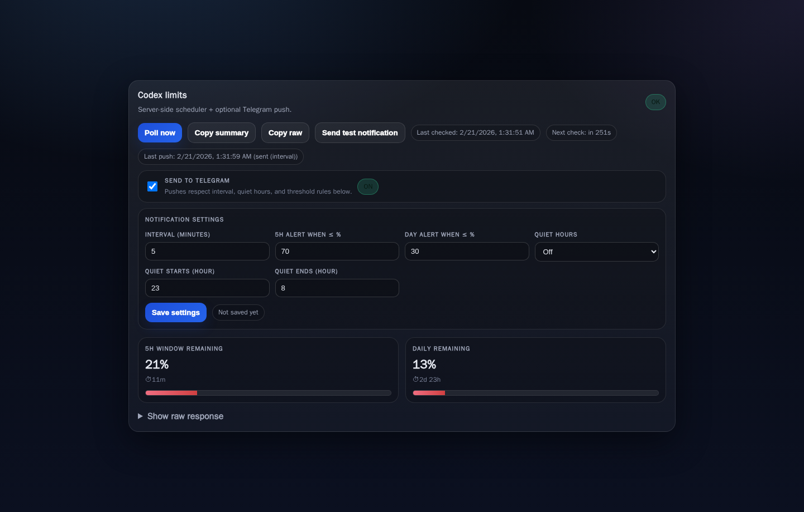
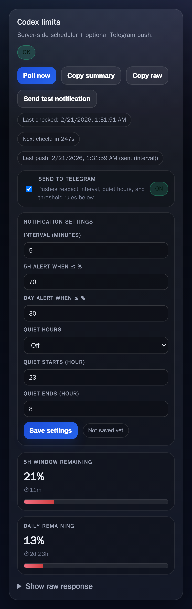

# OpenClaw Codex Limit UI

A tiny LAN-first web UI that shows **your remaining Codex/ChatGPT usage** from an OpenClaw Gateway.

It fetches `session_status` via the Gateway, parses the `Usage: 5h … · Day …` line, and renders a clean summary with progress bars.



## Features
- One-click “Check remaining balance”
- Readable summary cards:
  - **5h window remaining**
  - **Daily remaining**
- Progress bars (green/amber/red)
- Copy buttons (summary + raw JSON)
- Optional Telegram push interval (client-side timer)



## Run

```bash
npm i
node server.mjs
```

By default it listens on `0.0.0.0:7030`.

## Configuration
Environment variables:
- `PORT` (default `7030`)
- `HOST` (default `0.0.0.0`)
- `OPENCLAW_URL` (default `http://127.0.0.1:18789`)
- `OPENCLAW_SESSION_KEY` (default `main`)

Gateway auth:
- Set `OPENCLAW_TOKEN` **or** let it read from `~/.openclaw/openclaw.json`:
  - `gateway.auth.token` (mode=`token`)
  - `gateway.auth.password` (mode=`password`)

Telegram push (optional):
- `TELEGRAM_CHANNEL` (default `telegram`)
- `TELEGRAM_TARGET` (default `451330600`)

## Security
- No auth layer in this UI. Do not expose it to the public internet.
- Does not commit any tokens/keys.

## License
MIT.
